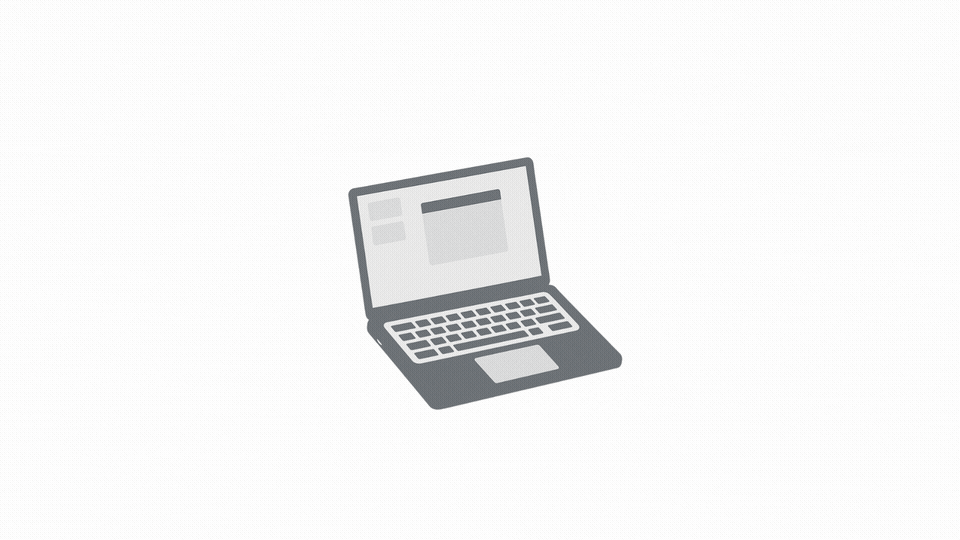

# MagSafe Guard

<p align="center">
  
</p>

<p align="center">
  <strong>MagSafe Guard</strong><br>
  <em>Your Mac's Security Guardian</em>
</p>

**Language:** English · [Deutsch (README.de.md)](README.de.md)

> **macOS security utility** — power cable as a dead-man's switch. Arm from the menu bar; unplugging triggers a grace period, then configurable protective actions.

Inspired by [BusKill](https://github.com/BusKill/buskill-app). Independent fork of [lekman/magsafe-buskill](https://github.com/lekman/magsafe-buskill).

**CI:** Lightweight Ubuntu checks on push/PR to `main` (commit messages). macOS tests and security scans: `task test` locally or run manually in [Actions](https://github.com/sutz2001/MagSafe-BusKill/actions).

| | |
| --- | --- |
| **Version** | `0.5.1` (build `10`) |
| **Platform** | macOS 13+ (Ventura) · menu bar app |
| **Bundle ID** | `com.sutz2001.MagSafeGuard` |
| **License** | MIT — [`LICENSE`](LICENSE) · [`NOTICE`](NOTICE) |
| **Repository** | **Public** — [github.com/sutz2001/MagSafe-BusKill](https://github.com/sutz2001/MagSafe-BusKill) |



---

## Upstream & this fork

| | |
| --- | --- |
| **Upstream** | [github.com/lekman/magsafe-buskill](https://github.com/lekman/magsafe-buskill) |
| **Development** | **Independent** — see [docs/FORK_INDEPENDENCE.md](docs/FORK_INDEPENDENCE.md) |
| **This fork** | [github.com/sutz2001/MagSafe-BusKill](https://github.com/sutz2001/MagSafe-BusKill) |
| **Fork maintainer** | Marc Seitz |
| **Attribution** | [`LICENSE`](LICENSE) (dual copyright) · [`NOTICE`](NOTICE) (provenance) |

Upstream targets the Mac App Store and paid Apple capabilities. **This fork** focuses on Personal Team signing, bilingual UI (EN/DE), operation presets, network actions, panic mode, release automation (`task release`), and **GitHub + notarized DMG** distribution — not the App Store.

---

## How it works

```text
  disarmed ──arm──► armed ──cable out──► grace period ──► security actions
                      ▲            │              │
                      │            └── cable back ─┘ (cancel grace, stay armed)
                      └──── auth (disarm / cancel) ────┘
```

| State | Behaviour |
| --- | --- |
| **Disarmed** | Unplugging power does **nothing** |
| **Armed** | Cable disconnect starts grace period (default **30 s**) |
| **Grace period** | Countdown in menu bar; cancel with Touch ID / password if enabled; **reconnecting power cancels grace and keeps the system armed** |
| **Triggered** | Enabled actions run in order (lock, alarm, logout, …) |

**Daily use:** menu bar icon → **Arm** → work with adapter connected → on theft risk, pull cable or wait for grace → actions execute.

**User guide (normal, discreet, panic):** [docs/features/user-guide.md](docs/features/user-guide.md) · [DE](docs/features/user-guide.de.md)

**Detailed behavior (states, grace, auto-arm, remote trigger):** [docs/features/operating-modes.md](docs/features/operating-modes.md)

| Shortcut / tip | |
| --- | --- |
| Event log | **⌘L** or menu → Event Log |
| Language | Settings → General → System / EN / DE |
| Operation mode & grace | Settings → **Security** (Normal / Discreet / Panic presets) |
| Menu bar only | Settings → General → **Show in Dock** off (default) |

---

## Feature status

| Area | Status | Notes |
| --- | --- | --- |
| Power disconnect (MagSafe, USB-C) | **Shipped** | IOKit, no kernel extension |
| Arm / disarm (Touch ID, password) | **Shipped** | Monitoring only when armed |
| Grace period + menu bar countdown | **Shipped** | Default 30 s; presets 20 s (Discreet) / 5 s (Panic profile) |
| Operation profiles (Normal / Discreet / Panic) | **Shipped** | v0.5.1 — Settings → Security · [guide](docs/features/user-guide.md#2-operation-profiles-settings-presets) |
| Security actions (5 types) | **Shipped** | Reorder in Settings → Security |
| Auto-arm (location / network) | **Shipped** | Optional permissions |
| Event log, onboarding, EN/DE | **Shipped** | v0.3.0 |
| Network actions + remote trigger | **Shipped** | v0.4.0 — webhook, VPN, SSH, clipboard, Wi‑Fi; `magsafeguard://` |
| Discreet operation | **Shipped** | v0.4.3+ — **Discreet** profile or notification toggles · [guide](docs/features/user-guide.md#4-discreet-operation) |
| Panic mode | **Shipped** | v0.5.0 — zero grace when panic-armed, **⌃⌘P** · [guide](docs/features/user-guide.md#5-panic-protection-mode-v050) |
| Paranoid mode | **Planned** | v0.6.0 — destruction + shutdown (FileVault + setup required) |
| Notarized DMG for others | **Later** | v1.0 · paid Apple Dev optional |
| Mac App Store | **Out of scope** | App Sandbox incompatible |

### Security actions

| Action | Effect |
| --- | --- |
| Lock Screen | Locks the display immediately |
| Sound Alarm | Looping alarm audio |
| Force Logout | Logs out all users |
| System Shutdown | Schedules shutdown (configurable delay) |
| Custom Script | `.sh` / `.zsh` / `.bash` from allowed paths only |

### Network actions

| Action | Effect |
| --- | --- |
| HTTP Webhook | POST JSON on trigger (token in Keychain) |
| Disconnect VPN | Stop active VPN connection |
| Clear SSH Agent | Remove keys from `ssh-agent` |
| Clear Clipboard | Empty the system pasteboard |
| Disable Wi‑Fi | Turn off Wi‑Fi (warns about Find My) |

Configure in **Settings → Security** (network section). **Panic** operation preset enables VPN, SSH agent, and clipboard clear (not Wi‑Fi off — keeps Find My).

**Custom script paths:** `~/.magsafe/scripts/` · `/usr/local/magsafe-scripts/`  
**Example scripts:** [docs/examples/scripts/](docs/examples/scripts/) (browser quit, browsing data best-effort)  
Security actions: **Settings → Security** (+ / − / drag to reorder).

---

## Build & run

Needs **macOS 13+**, **Xcode 15+**, and [Task](https://taskfile.dev) (`brew install go-task/tap/go-task`).  
A **free Apple ID** (Personal Team) is enough to build and run on your Mac.

### Quick start

```bash
git clone https://github.com/sutz2001/MagSafe-BusKill.git
cd MagSafe-BusKill
task setup
open MagSafeGuard.xcodeproj
```

In Xcode: **MagSafeGuard** → **Signing & Capabilities** → select your **Team** → **⌘R**.  
The app lives in the **menu bar**, not the Dock.

```bash
task run          # alternative: build Debug + launch from terminal
```

### Development

```bash
task build        # SPM library build
task test         # SPM tests + coverage (see docs/maintainers/testing-guide.md)
task xcode:test   # app-layer unit tests in Xcode
task qa:quick     # lint & security checks
task qa           # full local QA suite
```

### Release build (daily driver on your Mac)

```bash
task release              # version sync → tests → Release .app → DMG → SHA256
task release:install      # copy to /Applications
task release:open         # open DMG in Finder
```

Output directory: `dist/` (`MagSafeGuard-<version>.app`, `.dmg`, `SHA256SUMS`).

<details>
<summary>Release options (advanced)</summary>

```bash
SKIP_TESTS=true task release         # skip test suite
SIGN_MODE=adhoc task release:build    # ad-hoc signing fallback
SIGN_MODE=unsigned task release:build
task release:clean                   # remove dist/
```

</details>

**Signing note:** Personal Team builds expire after ~7 days — rebuild with `task release` or ⌘R in Xcode. Normal Apple code signing, not an app trial.

---

## Distribution

| Goal | Paid Apple Developer ($99/year)? |
| --- | --- |
| Clone source & build on your Mac | No — free Apple ID |
| Publish source on GitHub | No |
| Attach a `.dmg` to GitHub Releases for yourself | No |
| Others install your `.dmg` without Gatekeeper warnings | Yes — Developer ID + notarization |
| Mac App Store | Not planned (sandbox limits) |

**Model:** open source on GitHub; users **compile locally** or install a **notarized DMG** when available.

---

## Roadmap

| Phase | Version | Focus |
| --- | --- | --- |
| Done | **0.4.x** | Network actions, remote trigger, discreet operation |
| Done | **0.5.0** | Panic mode — 0 grace, **⌃⌘P** hotkey, immediate shutdown |
| Done | **0.5.1** | Operation profiles, clipboard network action, settings/docs polish |
| Next | **0.6.0** | Paranoid mode — data destruction (setup required) |
| Stable | **1.0.0** | Notarized Developer ID distribution |

Full plan: **[docs/FORK_ROADMAP.md](docs/FORK_ROADMAP.md)** · Releases: **[docs/FORK_CHANGELOG.md](docs/FORK_CHANGELOG.md)** · **User guide:** [EN](docs/features/user-guide.md) · [DE](docs/features/user-guide.de.md)

### Paranoid mode (v0.6.0 — not shipped)

> Design: **[docs/features/panic-modes.md](docs/features/panic-modes.md)**

- [ ] Full legal disclaimer (EN + DE): irreversible data loss, user responsibility, work-device warning
- [ ] Double confirmation + mandatory codeword
- [ ] Setup wizard (FileVault, wipe paths/volumes)
- [ ] Legal review for DE/EU (not legal advice — consult a lawyer)

**Panic (v0.5.0)** is shipped — see [user guide §5](docs/features/user-guide.md#5-panic-protection-mode-v050).

---

## Repository visibility

The repository is **public** at [github.com/sutz2001/MagSafe-BusKill](https://github.com/sutz2001/MagSafe-BusKill).

| Requirement | Status |
| --- | --- |
| [`LICENSE`](LICENSE) — MIT, upstream + fork copyright | Done |
| [`NOTICE`](NOTICE) — attribution, upstream link, BusKill credit | Done |
| README — fork vs upstream, maintainer, license pointers | Done |
| Binary releases include `LICENSE` + `NOTICE` | To do when publishing GitHub Releases |
| Panic-mode legal UI | Shipped in v0.5.0 (short notice EN/DE at first arm) |

The first three items were verified on `main` before the repository was made public (August 2026).

---

## Fork-specific settings

| Item | Value |
| --- | --- |
| Bundle ID | `com.sutz2001.MagSafeGuard` |
| Grace period default | 30 s |
| iCloud / Push | Removed from entitlements (Personal Team) |
| Version source | [`version.json`](version.json) → `task version:sync` |

```bash
task version:show
task version:bump:patch    # 0.3.0 → 0.3.1
task version:bump:minor    # 0.3.0 → 0.4.0
```

Optional upstream reference (manual only): `git fetch upstream && git merge upstream/main` — not required for fork development.

---

## Documentation

| Document | Description |
| --- | --- |
| [README.de.md](README.de.md) | German version of this file |
| [docs/features/user-guide.md](docs/features/user-guide.md) | **User guide** — operation profiles, discreet, panic · [DE](docs/features/user-guide.de.md) |
| [docs/features/operating-modes.md](docs/features/operating-modes.md) | State machine & technical flows |
| [docs/examples/scripts/README.md](docs/examples/scripts/README.md) | Example custom scripts |
| [docs/FORK_ROADMAP.md](docs/FORK_ROADMAP.md) | Feature roadmap & legal notes |
| [docs/FORK_CHANGELOG.md](docs/FORK_CHANGELOG.md) | Fork release history |
| [docs/maintainers/building-and-running.md](docs/maintainers/building-and-running.md) | Detailed build guide |
| [docs/maintainers/code-signing.md](docs/maintainers/code-signing.md) | Signing & distribution |
| [AGENTS.md](AGENTS.md) | Contributor & AI agent rules |

---

## License & disclaimer

**MIT License** — see [`LICENSE`](LICENSE) and [`NOTICE`](NOTICE). Redistributions must retain copyright and permission notices.

- Concept: [BusKill](https://github.com/BusKill/buskill-app)
- Upstream: Tobias Lekman · [lekman/magsafe-buskill](https://github.com/lekman/magsafe-buskill)
- Fork modifications: Marc Seitz © 2026

MagSafe Guard is a security utility provided **as is** without warranty. You are responsible for use on your devices, including work machines and custom scripts.
