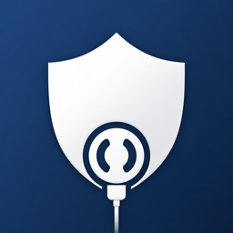

# MagSafe Guard

<p align="center">
  
</p>

<p align="center">
  <strong>MagSafe Guard</strong><br>
  <em>Your Mac's Security Guardian</em>
</p>

**Language:** English · [Deutsch (README.de.md)](README.de.md)

> **macOS security utility** — power cable as a dead-man's switch. Arm from the menu bar; unplugging triggers a grace period, then configurable protective actions.

Inspired by [BusKill](https://github.com/BusKill/buskill-app). Independent fork of [lekman/magsafe-buskill](https://github.com/lekman/magsafe-buskill).

[](https://github.com/sutz2001/MagSafe-BusKill/actions/workflows/test.yml)

| | |
| --- | --- |
| **Version** | `0.3.0` (build `3`) |
| **Platform** | macOS 13+ (Ventura) · menu bar app |
| **Bundle ID** | `com.sutz2001.MagSafeGuard` |
| **License** | MIT — [`LICENSE`](LICENSE) · [`NOTICE`](NOTICE) |
| **Repository** | **Public** — [github.com/sutz2001/MagSafe-BusKill](https://github.com/sutz2001/MagSafe-BusKill) |


---

## Upstream & this fork

| | |
| --- | --- |
| **Upstream** | [github.com/lekman/magsafe-buskill](https://github.com/lekman/magsafe-buskill) |
| **Upstream author** | Tobias Lekman |
| **This fork** | [github.com/sutz2001/MagSafe-BusKill](https://github.com/sutz2001/MagSafe-BusKill) |
| **Fork maintainer** | Marc Seitz |
| **Attribution** | [`LICENSE`](LICENSE) (dual copyright) · [`NOTICE`](NOTICE) (provenance) |

Upstream targets the Mac App Store and paid Apple capabilities. **This fork** focuses on Personal Team signing, bilingual UI (EN/DE), fork versioning, release automation (`task release`), and a roadmap toward network actions and panic mode — distributed via **GitHub + notarized DMG**, not the App Store.

---

## How it works

```text
  disarmed ──arm──► armed ──cable out──► grace period ──► security actions
                      ▲                         │
                      └──── auth (disarm / cancel) ┘
```

| State | Behaviour |
| --- | --- |
| **Disarmed** | Unplugging power does **nothing** |
| **Armed** | Cable disconnect starts grace period (default **30 s**) |
| **Grace period** | Countdown in menu bar; cancel with Touch ID / password if enabled |
| **Triggered** | Enabled actions run in order (lock, alarm, logout, …) |

**Daily use:** menu bar icon → **Arm** → work with adapter connected → on theft risk, pull cable or wait for grace → actions execute.

| Shortcut / tip | |
| --- | --- |
| Event log | **⌘L** or menu → Event Log |
| Language | Settings → General → System / EN / DE |
| Grace period | Settings → General (5–30 s) |

---

## Feature status

| Area | Status | Notes |
| --- | --- | --- |
| Power disconnect (MagSafe, USB-C) | **Shipped** | IOKit, no kernel extension |
| Arm / disarm (Touch ID, password) | **Shipped** | Monitoring only when armed |
| Grace period + menu bar countdown | **Shipped** | Default 30 s |
| Security actions (5 types) | **Shipped** | Reorder in Settings |
| Auto-arm (location / network) | **Shipped** | Optional permissions |
| Event log, onboarding, EN/DE | **Shipped** | v0.3.0 |
| Network actions + remote trigger | **Planned** | [Roadmap](docs/FORK_ROADMAP.md) · v0.4.0 |
| Panic mode | **Planned** | v0.5.0 · [legal prerequisites](#before-panic-mode-ships) |
| Notarized DMG for others | **Later** | v1.0 · paid Apple Dev optional |
| Mac App Store | **Out of scope** | App Sandbox incompatible |

### Security actions

| Action | Effect |
| --- | --- |
| Lock Screen | Locks the display immediately |
| Sound Alarm | Looping alarm audio |
| Force Logout | Logs out all users |
| System Shutdown | Schedules shutdown (configurable delay) |
| Custom Script | `.sh` / `.zsh` / `.bash` from allowed paths only |

**Paths:** `~/.magsafe/scripts/` · `/usr/local/magsafe-scripts/`  
Configure in **Settings → Security** (+ / − / drag to reorder).

---

## Build & run

Needs **macOS 13+**, **Xcode 15+**, and [Task](https://taskfile.dev) (`brew install go-task/tap/go-task`).  
A **free Apple ID** (Personal Team) is enough to build and run on your Mac.

### Quick start

```bash
git clone https://github.com/sutz2001/MagSafe-BusKill.git
cd MagSafe-BusKill
task setup
open MagSafeGuard.xcodeproj
```

In Xcode: **MagSafeGuard** → **Signing & Capabilities** → select your **Team** → **⌘R**.  
The app lives in the **menu bar**, not the Dock.

```bash
task run          # alternative: build Debug + launch from terminal
```

### Development

```bash
task build        # SPM library build
task test         # unit tests + coverage
task qa:quick     # lint & security checks
task qa           # full local QA suite
```

### Release build (daily driver on your Mac)

```bash
task release              # version sync → tests → Release .app → DMG → SHA256
task release:install      # copy to /Applications
task release:open         # open DMG in Finder
```

Output directory: `dist/` (`MagSafeGuard-<version>.app`, `.dmg`, `SHA256SUMS`).

<details>
<summary>Release options (advanced)</summary>

```bash
SKIP_TESTS=true task release         # skip test suite
SIGN_MODE=adhoc task release:build    # ad-hoc signing fallback
SIGN_MODE=unsigned task release:build
task release:clean                   # remove dist/
```

</details>

**Signing note:** Personal Team builds expire after ~7 days — rebuild with `task release` or ⌘R in Xcode. Normal Apple code signing, not an app trial.

---

## Distribution

| Goal | Paid Apple Developer ($99/year)? |
| --- | --- |
| Clone source & build on your Mac | No — free Apple ID |
| Publish source on GitHub | No |
| Attach a `.dmg` to GitHub Releases for yourself | No |
| Others install your `.dmg` without Gatekeeper warnings | Yes — Developer ID + notarization |
| Mac App Store | Not planned (sandbox limits) |

**Model:** open source on GitHub; users **compile locally** or install a **notarized DMG** when available.

---

## Roadmap

| Phase | Version | Focus |
| --- | --- | --- |
| Now | **0.3.0** | Core dead-man's switch, event log, i18n, `task release` |
| Next | **0.4.0** | Network actions (webhook, VPN, SSH, Wi‑Fi) + remote trigger |
| Then | **0.5.0** | Panic mode (hotkey, remote) — after legal checklist |
| Stable | **1.0.0** | Notarized Developer ID distribution |

Full plan: **[docs/FORK_ROADMAP.md](docs/FORK_ROADMAP.md)** · Releases: **[docs/FORK_CHANGELOG.md](docs/FORK_CHANGELOG.md)**

### Before panic mode ships

> **Required before any panic-mode release** (including beta):

- [ ] In-app legal disclaimer (EN + DE): irreversible data loss, user responsibility, employer/work-device warning
- [ ] Double confirmation + mandatory codeword to arm panic mode
- [ ] No destructive “test run” in production builds
- [ ] Legal review for DE/EU publication (not legal advice — consult a lawyer)

---

## Repository visibility

The repository is **public** at [github.com/sutz2001/MagSafe-BusKill](https://github.com/sutz2001/MagSafe-BusKill).

| Requirement | Status |
| --- | --- |
| [`LICENSE`](LICENSE) — MIT, upstream + fork copyright | Done |
| [`NOTICE`](NOTICE) — attribution, upstream link, BusKill credit | Done |
| README — fork vs upstream, maintainer, license pointers | Done |
| Binary releases include `LICENSE` + `NOTICE` | To do when publishing GitHub Releases |
| Panic-mode legal UI (only if feature ships) | Not applicable until v0.5.0 |

The first three items were verified on `main` before the repository was made public (August 2026).

---

## Fork-specific settings

| Item | Value |
| --- | --- |
| Bundle ID | `com.sutz2001.MagSafeGuard` |
| Grace period default | 30 s |
| iCloud / Push | Removed from entitlements (Personal Team) |
| Version source | [`version.json`](version.json) → `task version:sync` |

```bash
task version:show
task version:bump:patch    # 0.3.0 → 0.3.1
task version:bump:minor    # 0.3.0 → 0.4.0
```

Sync with upstream: `git fetch upstream && git merge upstream/main`

---

## Documentation

| Document | Description |
| --- | --- |
| [README.de.md](README.de.md) | German version of this file |
| [docs/FORK_ROADMAP.md](docs/FORK_ROADMAP.md) | Feature roadmap & legal notes |
| [docs/FORK_CHANGELOG.md](docs/FORK_CHANGELOG.md) | Fork release history |
| [docs/maintainers/building-and-running.md](docs/maintainers/building-and-running.md) | Detailed build guide |
| [docs/maintainers/code-signing.md](docs/maintainers/code-signing.md) | Signing & distribution |
| [AGENTS.md](AGENTS.md) | Contributor & AI agent rules |

---

## License & disclaimer

**MIT License** — see [`LICENSE`](LICENSE) and [`NOTICE`](NOTICE). Redistributions must retain copyright and permission notices.

- Concept: [BusKill](https://github.com/BusKill/buskill-app)
- Upstream: Tobias Lekman · [lekman/magsafe-buskill](https://github.com/lekman/magsafe-buskill)
- Fork modifications: Marc Seitz © 2025

MagSafe Guard is a security utility provided **as is** without warranty. You are responsible for use on your devices, including work machines and custom scripts.
