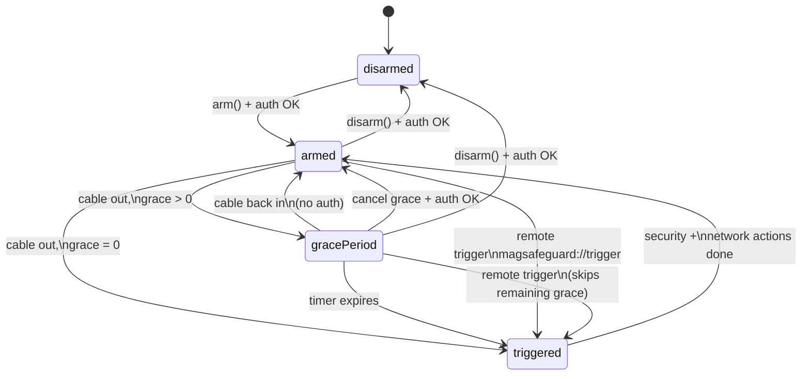
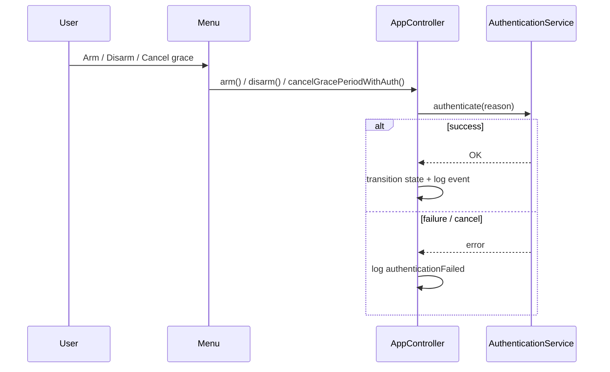
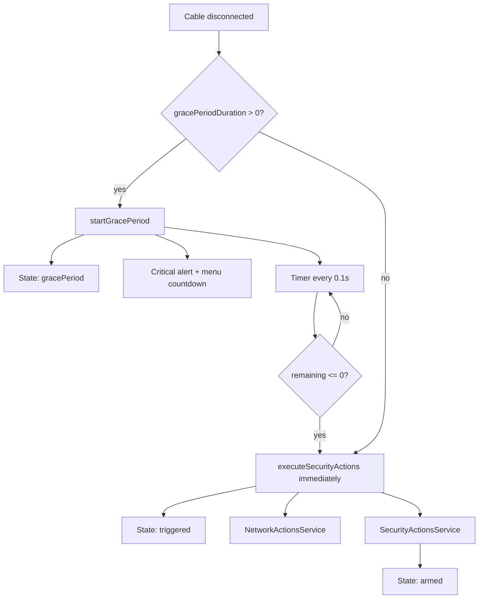
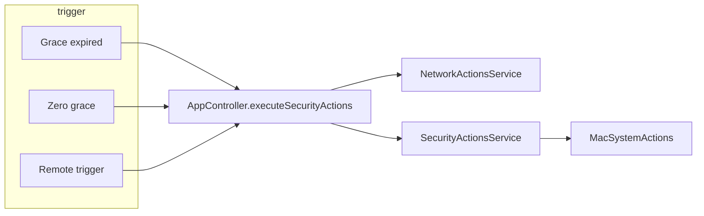
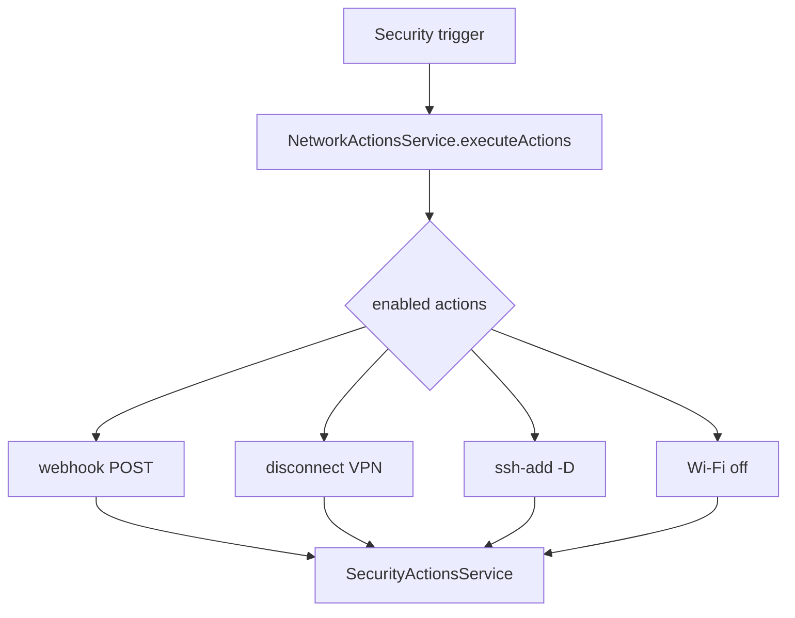
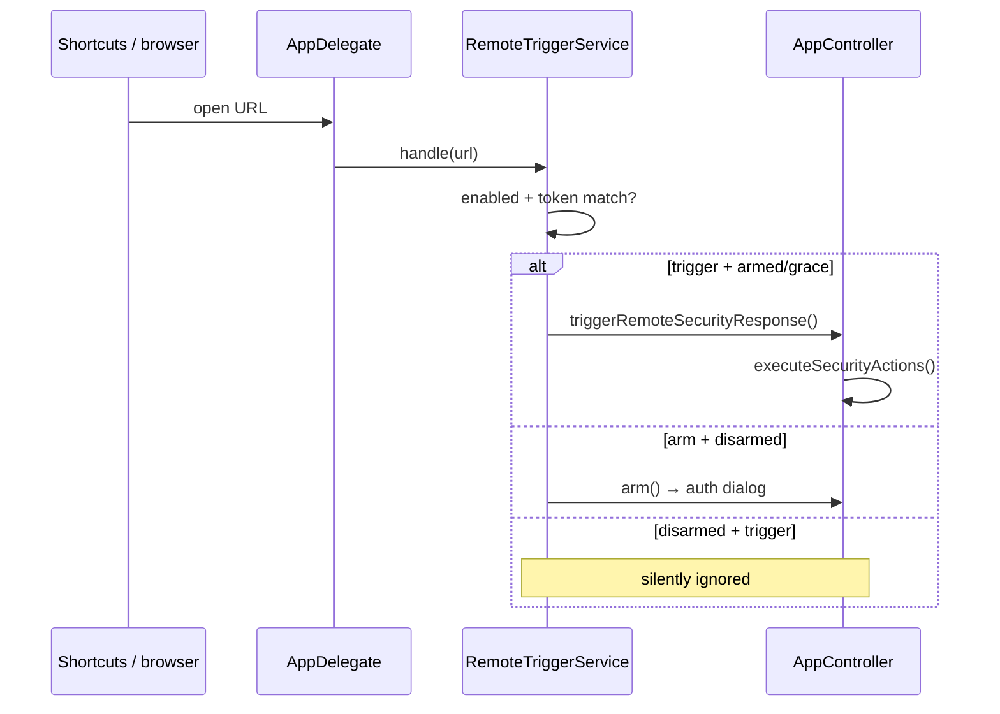
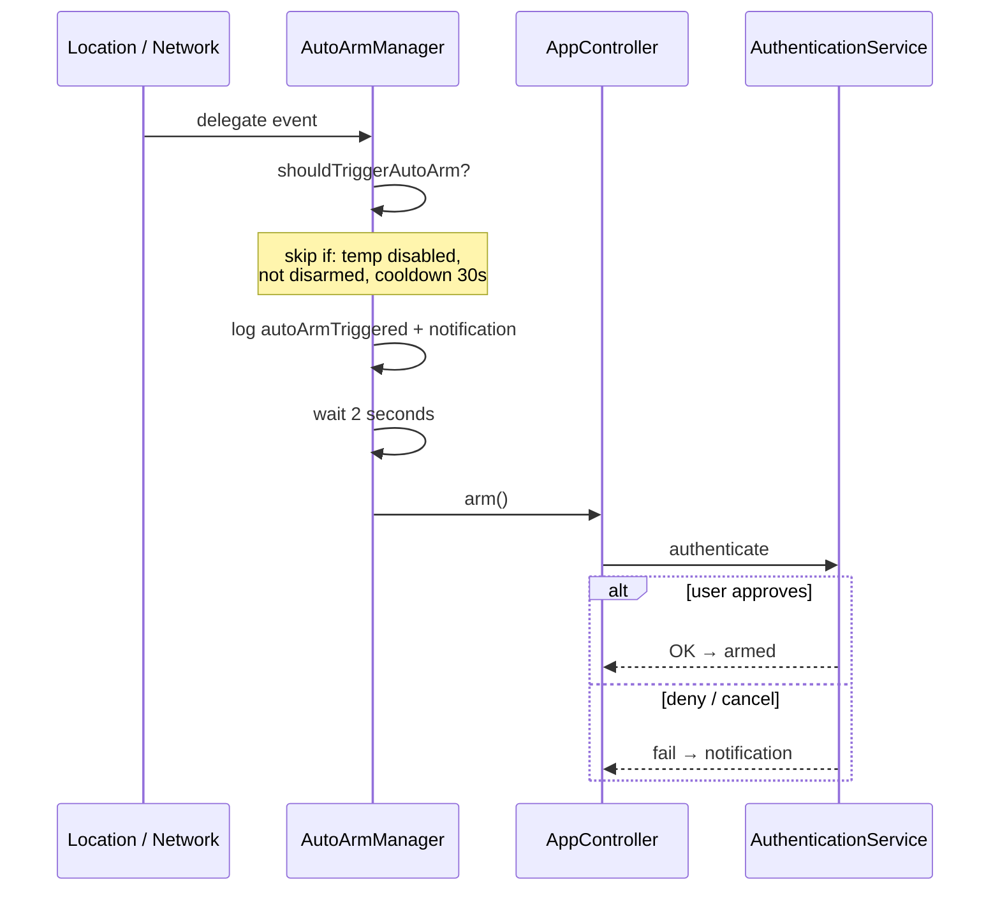

# Operating Modes & Behavioral Flows

**Audience:** Users, contributors, and maintainers who need to know what the app *actually does* at runtime (not what the UI implies).

**Version:** documents behavior as of fork **0.4.2** (build 7).  
**Primary code:** `MagSafeGuard/Controllers/AppController.swift`, services under `MagSafeGuard/Services/`.

**Related:** [Behavior gaps & fix backlog](behavior-gaps.md) · [FORK_ROADMAP](../FORK_ROADMAP.md) (planned features) · [README](../../README.md)

---

## Overview

MagSafe Guard is a **menu bar dead-man's switch**: when **armed**, unplugging external power starts a **grace period**, then runs **security actions** (and optional **network actions**). The system is **disarmed** by default — unplugging does nothing until you arm.

| Concept | What it means |
|--------|----------------|
| **Mode / state** | One of four `AppState` values (disarmed, armed, grace period, triggered) |
| **Security action** | Lock screen, alarm, logout, shutdown, or custom script |
| **Network action** | Webhook, VPN disconnect, SSH agent clear, Wi‑Fi off (v0.4.0) |
| **Auto-arm** | Optional automatic *attempt* to arm when location/network rules fire |
| **Remote trigger** | Optional `magsafeguard://` URL to arm or fire actions from Shortcuts |
| **Panic mode** | **Not implemented** — planned v0.5.0 (see [Planned: Panic mode](#planned-panic-mode-v050)) |

---

## 1. Application states (`AppState`)

Defined in `AppController.swift`. These drive the menu bar icon, grace countdown, and which events are logged.

| State | Menu bar | Power disconnect while in this state |
|-------|----------|--------------------------------------|
| **disarmed** | Shield (open) | Ignored — no grace, no actions |
| **armed** | Shield (filled) | Starts grace period (or immediate trigger if grace = 0) |
| **gracePeriod** | Grace icon + countdown | Already in grace; timer continues |
| **triggered** | Triggered icon | Transient — actions running; returns to **armed** when done |

### State machine

**Notes:**

- **`triggered` is short-lived.** After `SecurityActionsService` finishes, state returns to **armed** automatically (not disarmed). Older comments in code/docs that say “manual reset” are outdated.
- **Reconnect during grace** (v0.3.1+): plugging power back in cancels grace and keeps the system **armed** without running actions.
- **Quit during grace:** macOS shows a confirmation dialog (`AppDelegate.applicationShouldTerminate`).

---

## 2. Arming and disarming

### Arm (`arm()`)

| | |
|---|---|
| **From** | `disarmed` only |
| **Auth** | Touch ID / password (`AuthenticationService`) |
| **Side effects** | Event `armed`, status notification (if enabled), optional restore from `ApplicationStatePersistence` on next launch |

**Entry points:**

- Menu bar → Arm (⌘A)
- Auto-arm (after 2 s delay — still requires auth dialog)
- Remote: `magsafeguard://arm?token=…` (if remote trigger enabled)

### Disarm (`disarm()`)

| | |
|---|---|
| **From** | `armed` or `gracePeriod` |
| **Auth** | Required |
| **Side effects** | Cancels grace timer if active; event `disarmed` |

**Not allowed from** `triggered` (must wait until actions complete and state returns to armed).

### Auth flow (simplified)

---

## 3. Grace period

### Settings (General tab)

| Setting | Default | Range / behavior |
|---------|---------|------------------|
| `gracePeriodDuration` | 30 s | Clamped **5–30 s** in `Settings.validated()` |
| `allowGracePeriodCancellation` | `true` | Controls **auth-based** cancel only |

### On power disconnect (while armed)

### Ways to **cancel** grace (no security actions)

| Method | Auth required? | `allowGracePeriodCancellation` |
|--------|----------------|----------------------------------|
| **Power reconnect** | No | Not checked — always cancels |
| **Menu “Cancel Action” (⌘C)** | Yes | Must be `true` |
| **Alert window button** (fallback UI) | Yes | Must be `true` |
| **Disarm** | Yes | N/A |

If `allowGracePeriodCancellation` is **false**, only **reconnect** and **disarm** can stop the countdown.

---

## 4. Security actions (five types)

Domain enum: `SecurityActionType` in `MagSafeGuardLib/.../SecurityActionProtocols.swift`.  
Runtime executor: `SecurityActionsService` in `MagSafeGuard/Services/SecurityActionsService.swift`.

| Action | Effect | Default in Settings UI | Default in `SecurityActionsService` |
|--------|--------|------------------------|-------------------------------------|
| Lock screen | `CGSession` / screen lock | Enabled | Enabled |
| Sound alarm | Looping alarm audio | Enabled | Disabled |
| Force logout | Log out all users | Off | Off |
| System shutdown | Schedule shutdown (30 s delay in service config) | Off | Off |
| Custom script | Run `.sh` / `.zsh` / `.bash` from allowed paths | Off | Off (needs path in service config) |

### When actions run

1. Grace period expires  
2. Grace duration = 0 on disconnect  
3. Remote URL `magsafeguard://trigger?token=…` (while armed or in grace)

### Execution pipeline

**`SecurityActionsService` behavior:**

- Runs actions **sequentially** by default (parallel optional in service config, not exposed in Settings UI).
- Runs actions in **Settings → Security** drag order (`actionOrder` synced on save)
- **Rate limit:** minimum 5 s between runs; max 10 per 60 s window.
- **Circuit breaker:** 3 consecutive failures → open for 60 s.
- Second `executeActions` call while running is **ignored**.

**Allowed script paths** (README): `~/.magsafe/scripts/`, `/usr/local/magsafe-scripts/`.

---

## 5. Network actions (v0.4.0)

Configured in **Settings → Security** (network section). Executed **once per trigger**, in list order, **before** security actions complete (started from the same `executeSecurityActions` call).

| Type | What it does | Implementation |
|------|----------------|----------------|
| **HTTP webhook** | POST JSON `{event, source, timestamp}` | `URLSession`; Bearer token from Keychain |
| **Disconnect VPN** | Stop active VPN | AppleScript + `scutil --nc stop` |
| **Clear SSH agent** | Remove loaded keys | `/usr/bin/ssh-add -D` |
| **Disable Wi‑Fi** | Turn off Wi‑Fi interface | `networksetup -setairportpower off` |

Failures are logged only; they do **not** block security actions or appear in the event log per action.

**Not implemented:** DNS/proxy reset (roadmap item).

---

## 6. Remote trigger (`magsafeguard://`)

Registered in `Info.plist`. Handler: `RemoteTriggerService` + `AppDelegate.application(_:open:)`.

| URL host | Behavior | Preconditions |
|----------|----------|---------------|
| `trigger` | Immediate `triggerRemoteSecurityResponse()` → network + security actions | Remote trigger **enabled**, valid `?token=`, state **armed** or **gracePeriod** |
| `arm` | `arm()` if disarmed | Enabled + token + user passes auth dialog |
| *(other)* | Logged warning, ignored | — |

**Examples:**

- Trigger actions: `magsafeguard://trigger?token=YOUR_SECRET`
- Arm remotely: `magsafeguard://arm?token=YOUR_SECRET`

**Security:** plain string token comparison; empty token rejects all requests. Token stored in settings (not Keychain).

**This is not Panic mode** — same grace bypass as manual trigger path, no separate panic executor.

---

## 7. Auto-arm

**Service:** `AutoArmManager`. **Default:** off (`autoArmEnabled = false`).

### Sub-modes

| Setting | Trigger condition | User-visible reason (localized) |
|---------|-------------------|----------------------------------|
| `autoArmByLocation` | Leave trusted geofence | Left trusted location |
| `autoArmOnUntrustedNetwork` | Connect to untrusted SSID | Untrusted network name |
| Same | Disconnect from trusted Wi‑Fi | Left trusted network |
| Same | No network connectivity | Lost connectivity |

### Auto-arm sequence

### Additional controls

| Control | Behavior |
|---------|----------|
| **Cooldown** | 30 s minimum between auto-arm attempts |
| **Temp disable** | Default 1 h; blocks all auto-arm triggers |
| **Enter trusted location** | Logged only — **does not auto-disarm** |
| **Connect trusted network** | Logged only — **does not auto-disarm** |

Monitoring starts when `autoArmEnabled` is true — at launch and when toggled mid-session (`AutoArmManager.updateSettings()`).

Auto-arm uses `armAutomatically()` after a 2 s notification delay — **no Touch ID/password prompt** (user opted in via settings). Remote `magsafeguard://arm?token=…` uses the same path when remote trigger is enabled.

---

## 8. Event log

**Open:** ⌘L or menu → Event Log. In-memory, max **1000** entries.

| `AppEvent` | When logged |
|------------|-------------|
| `armed` / `disarmed` | State transition |
| `powerDisconnected` | Cable out while armed |
| `powerConnected` | Cable in (any state) |
| `gracePeriodStarted` | Grace begins |
| `gracePeriodCancelled` | Reconnect, auth cancel, or internal cancel |
| `securityActionExecuted` | After security action batch (incl. remote trigger) |
| `networkActionExecuted` | Each successful network action |
| `networkActionFailed` | Each failed network action |
| `authenticationSucceeded` / `authenticationFailed` | Arm, disarm, cancel grace |
| `autoArmTriggered` | Auto-arm condition met |
| `applicationTerminating` | App quit |

**Not logged:** remote trigger rejected (wrong/disabled token).

---

## 9. Settings vs runtime (quick reference)

| Setting (tab) | Affects runtime? |
|---------------|------------------|
| Grace period, allow cancel (General) | **Yes** |
| Restore armed on launch (General) | **Yes** |
| Security action list / order (Security) | **Yes** — synced via `SecurityActionsSettingsSync` |
| Network actions + webhook (Security) | **Yes** |
| Remote trigger token (Security) | **Yes** |
| Auto-arm toggles + trusted networks (Auto-Arm) | **Yes** |
| Status notifications (Notifications) | **Yes** for normal notifications |
| Critical alert sound (Notifications) | **Yes** — on grace critical alerts |
| Launch at login, show in dock (General) | **Yes** — `SMAppService` + activation policy |
| Custom scripts list (Advanced) | **Yes** when custom script action enabled |
| Debug logging (Advanced) | **Yes** — Release `Log.debug` |

Full gap list: [behavior-gaps.md](behavior-gaps.md).

---

## 10. Planned: Panic mode (v0.5.0)

**Status:** not in codebase. Documented in [FORK_ROADMAP.md](../FORK_ROADMAP.md).

| Aspect | Normal (armed) today | Planned panic |
|--------|----------------------|---------------|
| Grace period | 5–30 s | **0 s** |
| Execution | Sequential + rate limits | Parallel, breaker off |
| Cancel | Auth / reconnect | **None** |
| Triggers | Cable, remote `trigger` | + hotkey, `panic` URL |
| Measures | 5 security + network | Extended destructive set |

Do not confuse `magsafeguard://trigger` with panic mode.

---

## 11. End-to-end: typical theft scenario

```mermaid
flowchart TD
    subgraph daily
        D1[Disarmed] -->|User arms + Touch ID| D2[Armed]
        D2 -->|Work with adapter| D2
    end

    subgraph incident
        D2 -->|Thief pulls cable| G{Grace > 0?}
        G -->|yes| GP[Grace countdown 30s]
        G -->|no| ACT[Actions]
        GP -->|User reconnects| D2
        GP -->|Timer ends| ACT
        GP -->|User cancels + auth| D2
        ACT --> NA[Network actions if enabled]
        NA --> SA[Security actions]
        SA --> D2
    end
```

---

## Code map

| Area | Primary files |
|------|----------------|
| State machine | `MagSafeGuard/Controllers/AppController.swift` |
| Power monitoring | `MagSafeGuard/Services/PowerMonitorService.swift`, `PowerMonitorCore.swift` |
| Security actions | `MagSafeGuard/Services/SecurityActionsService.swift`, `MacSystemActions.swift` |
| Network actions | `NetworkActionsService.swift`, `MacNetworkActions.swift` |
| Remote URLs | `RemoteTriggerService.swift`, `AppDelegate.swift` |
| Auto-arm | `AutoArmManager.swift`, `LocationManager.swift`, `NetworkMonitor.swift` |
| Settings model | `MagSafeGuardLib/.../SettingsModel.swift`, `SettingsView.swift` |
| Event log UI | `MagSafeGuard/Views/EventLog/EventLogView.swift` |

---

*Last updated: 2026-08-31 (fork 0.4.0 analysis).*
